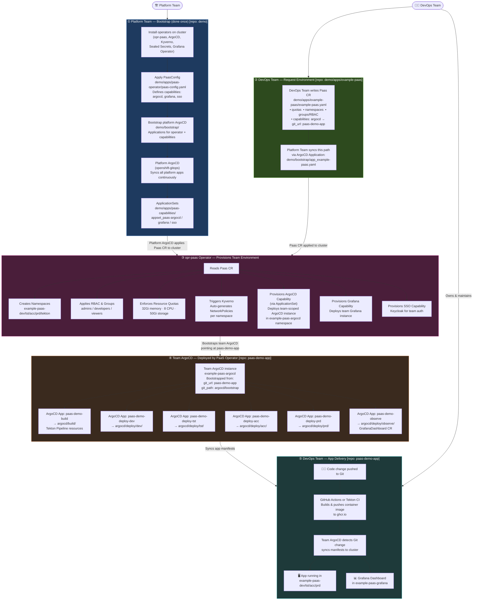

# PaaS Operator — How It Works

This document explains how the **Platform Team** and **DevOps Teams** interact with the [opr-paas](https://github.com/belastingdienst/opr-paas) operator, and how a DevOps team goes from a single YAML file to a fully running application on OpenShift.

> 📂 **Further reading**
> - [`demo/`](demo/README.md) — Platform Team repo: operator install, PaasConfig, platform ArgoCD bootstrap, capability Helm charts
> - [`paas-demo-app/`](paas-demo-app/README.md) — DevOps Team repo: application code, ArgoCD bootstrap, deploy manifests, Grafana dashboard

---

## Responsibilities at a glance

| | Platform Team | DevOps Team |
|---|---|---|
| **Repo** | `demo/` | `demo/apps/example-paas/` + `paas-demo-app/` |
| **What they own** | Cluster bootstrap, operators, PaasConfig, platform ArgoCD | Their `Paas` CR, their application code, their ArgoCD apps |
| **Done once?** | Yes — bootstrap is a one-time setup | No — teams iterate on their app continuously |

---

## Flow

---

## Step-by-step explanation

### ① Platform Team — Bootstrap *(done once)*
The Platform Team sets up the cluster foundation using the [`demo/`](demo/) repo:
- Installs all required operators (opr-paas, ArgoCD, Kyverno, Sealed Secrets, Grafana Operator)
- Applies a `PaasConfig` that defines which capabilities are available (ArgoCD, Grafana, SSO) and how they are templated
- Bootstraps the platform-level ArgoCD (`openshift-gitops`) which continuously syncs everything in `demo/`
- In this case, apply the bootstrap applications by hand (for demo purposes)

### ② DevOps Team — Request an Environment
The DevOps Team's only interaction with the `demo` repo is a **single YAML file**:
[`demo/apps/example-paas/example-paas.yaml`](demo/apps/example-paas/example-paas.yaml)

This `Paas` CR declares:
- Which namespaces they need (`dev`, `tst`, `acc`, `prd`, `tekton`)
- Who gets access and with what role (admins, developers, viewers)
- Which capabilities to enable, and for ArgoCD: which Git repo to bootstrap from

The Platform Team's ArgoCD syncs this file to the cluster via [`demo/bootstrap/app_example-paas.yaml`](demo/bootstrap/app_example-paas.yaml).

### ③ opr-paas Operator — Automatic Provisioning
Once the `Paas` CR lands on the cluster, the operator takes over and automatically provisions:
- All declared namespaces
- RBAC and group bindings
- Resource quotas
- Kyverno-generated NetworkPolicies
- Capability instances: a team-scoped ArgoCD, Grafana, and SSO

### ④ Team ArgoCD — Bootstrapped by PaaS
The ArgoCD instance the operator created reads the `git_url` and `git_path` from the `Paas` CR and bootstraps itself from the DevOps team's own repo ([`paas-demo-app/argocd/bootstrap/`](paas-demo-app/argocd/bootstrap/)). From this point on, the team manages their own ArgoCD applications entirely independently.

### ⑤ DevOps Team — Ship Their Application
The team works entirely in [`paas-demo-app/`](paas-demo-app/):
- Push code → GitHub Actions or Tekton builds and pushes the container image
- Their ArgoCD detects the Git change and syncs manifests into the namespaces PaaS created
- Grafana dashboards are deployed automatically via the `observe` ArgoCD application

> **One YAML file. One team. Full environment — namespaces, RBAC, ArgoCD, Grafana, SSO — all automatic.**
