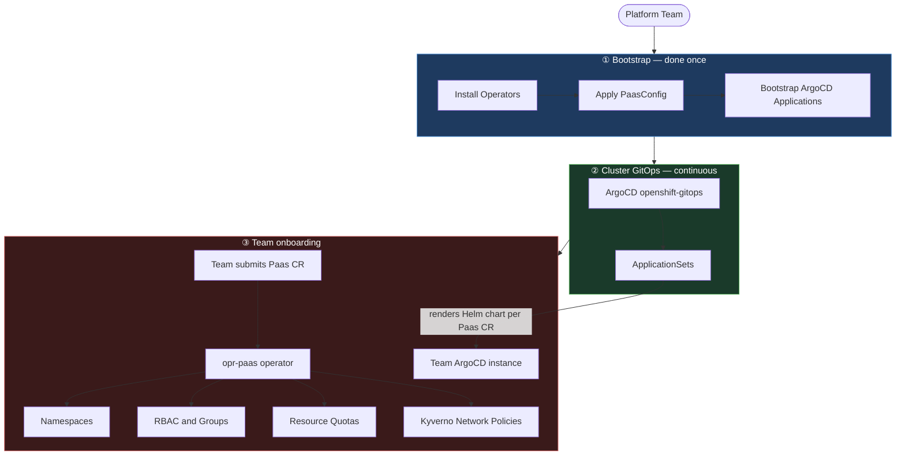

# PaaS Demo — OpenShift GitOps Platform

This repo is a **booth demo** showing how teams can self-service their own platform environment on OpenShift using the [opr-paas](https://github.com/belastingdienst/opr-paas) operator, GitOps, and policy-as-code.

---

## What it demonstrates

A developer submits a single `Paas` custom resource (see [`example-paas.yaml`](example-paas.yaml)) and gets a fully provisioned, isolated platform environment — automatically:

- **Namespaces** (`dev`, `tst`, `acc`, `prd`, `tekton`) with RBAC applied
- **ArgoCD** instance scoped to the team, bootstrapped from their own Git repo
- **Grafana** instance with Prometheus datasource pre-wired
- **SSO** (Keycloak) for authentication
- **Resource quotas** enforced per environment
- **Network policies** auto-generated via Kyverno

---

## Stack

| Component | Role |
|---|---|
| [opr-paas](https://github.com/belastingdienst/opr-paas) | Core operator — provisions namespaces, RBAC, quotas, capabilities |
| OpenShift GitOps (ArgoCD) | Cluster-level GitOps, bootstraps all apps |
| OpenShift Pipelines (Tekton) | CI/CD pipelines per team |
| Kyverno | Policy enforcement & auto-generated network policies |
| Grafana Operator | Per-team Grafana instances |
| Sealed Secrets | Encrypted secrets safe to store in Git |
| cert-manager | TLS certificate management |

---

## Repo structure

```
bootstrap/        # ArgoCD Applications that bootstrap the platform
apps/
  paas-operator/  # opr-paas operator install + PaasConfig
  paas-capabilities/ # ApplicationSets for ArgoCD, Grafana, SSO capabilities
  kyverno/        # Kyverno policies (network policies, self-provisioner lockdown)
  sealed-secrets/ # Sealed Secrets controller
helm/
  capability-*/   # Helm charts for each PaaS capability
example-paas.yaml # Example: one Paas CR = one full team environment
```

---

## How it works



> **One YAML file. One team. Full environment.**
